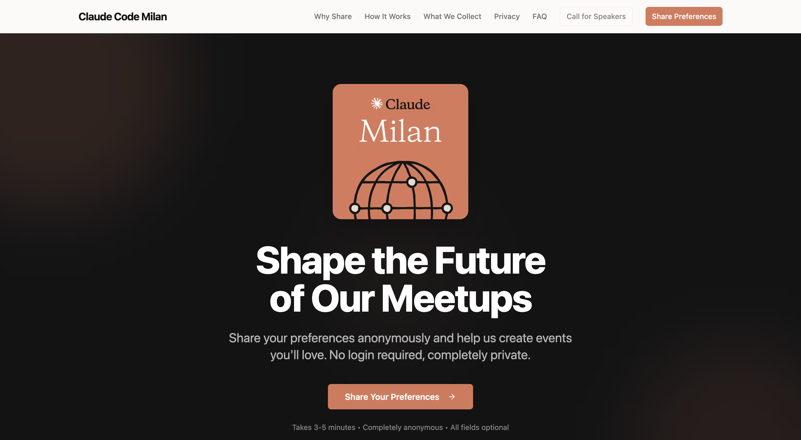
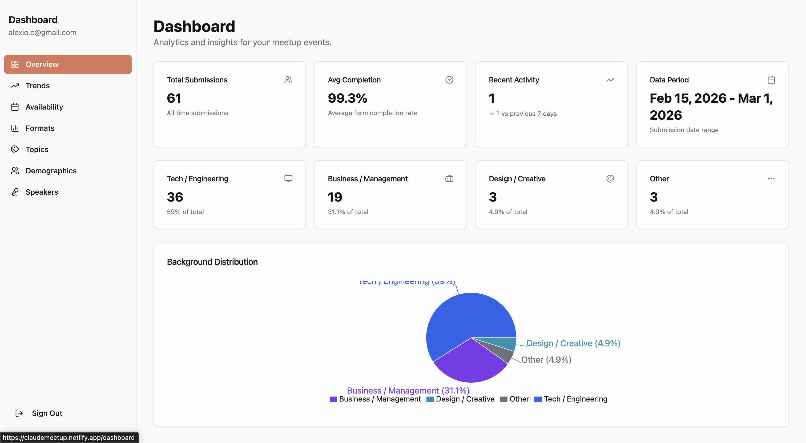
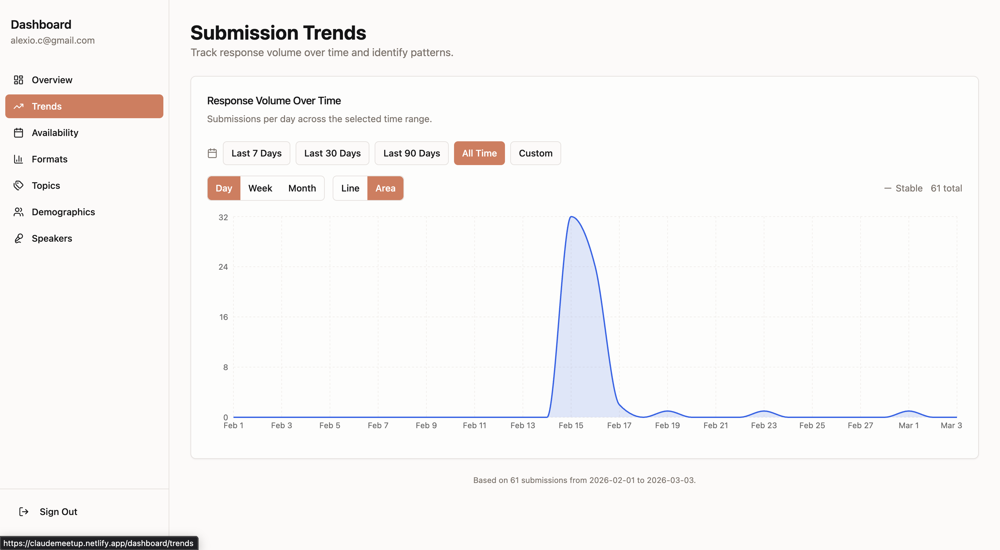
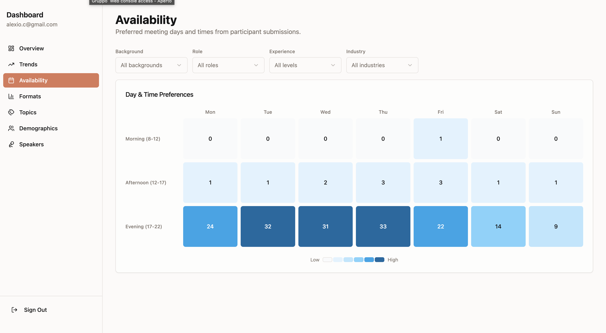
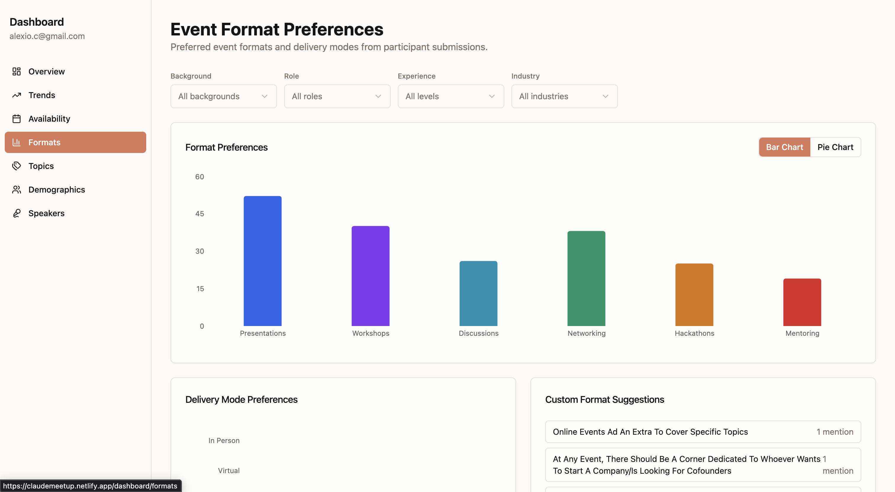
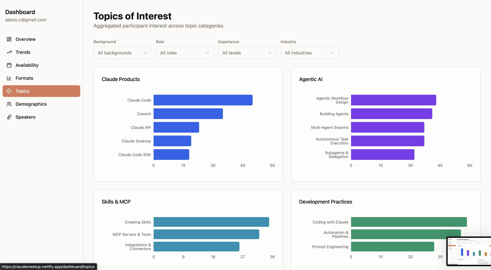
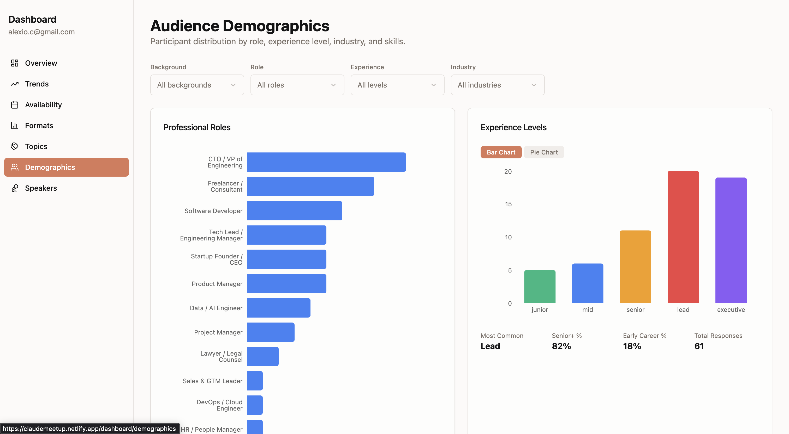
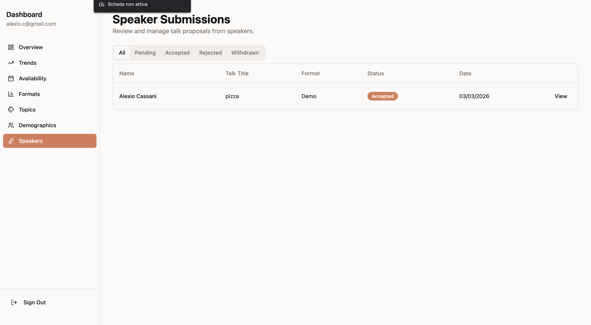

# CommunityPulse

[](LICENSE)
[](https://vercel.com/new/clone?repository-url=https%3A%2F%2Fgithub.com%2FYOUR_USERNAME%2Fcommunity-pulse&env=NEXT_PUBLIC_SUPABASE_URL,NEXT_PUBLIC_SUPABASE_ANON_KEY,SUPABASE_SERVICE_ROLE_KEY&envDescription=Supabase%20credentials%20required%20for%20the%20app&envLink=https%3A%2F%2Fsupabase.com%2Fdashboard%2Fproject%2F_%2Fsettings%2Fapi)

Community events organizer app. Collects anonymous attendee preferences, manages speaker submissions, and provides an admin analytics dashboard.

## Features

- **Meetup management** — Create, edit, and publish meetups from the dashboard; upcoming meetups shown on homepage with Luma registration link or "Coming Soon" badge
- **Anonymous preference form** — Multi-step form for attendees to share availability, topic interests, and format preferences without authentication
- **Speaker portal** — Speakers submit talk proposals with preferred meetup selection, track status, and communicate with organizers via a token-based portal
- **Community link** — Admin-configurable Telegram/WhatsApp link displayed on homepage (Hero, CTA, GetInvolved sections)
- **Admin dashboard** — Analytics charts (demographics, trends, availability heatmap, topics, formats), speaker and meetup management, site settings
- **Email notifications** — Automated speaker emails (confirmation, status changes, new messages) via Resend

## Getting Started

```bash
npm run setup
```

This single command copies `.env.local.example` to `.env.local` (without overwriting an existing file) and installs all dependencies. It is idempotent — safe to re-run.

After setup, fill in your credentials in `.env.local`, then start the dev server:

```bash
npm run dev
```

### Environment Variables

| Variable | Required | Description |
|---|---|---|
| `NEXT_PUBLIC_SUPABASE_URL` | Required | Supabase project URL |
| `NEXT_PUBLIC_SUPABASE_ANON_KEY` | Required | Supabase anon/public key |
| `SUPABASE_SERVICE_ROLE_KEY` | Required | Supabase service role key (server-side only) |
| `RESEND_API_KEY` | Optional | Email delivery — skipped if not set |
| `EMAIL_FROM` | Optional | Sender address for emails |
| `ADMIN_NOTIFICATION_EMAIL` | Optional | Recipient for admin alerts |
| `NEXT_PUBLIC_APP_URL` | Required | App base URL (use `http://localhost:3000` locally) |
| `NEXT_PUBLIC_COMMUNITY_NAME` | Optional | Branding — defaults to generic values |

### Available Commands

| Command | Description |
|---|---|
| `npm run dev` | Start dev server at http://localhost:3000 |
| `npm run build` | Production build |
| `npm run lint` | Run ESLint on `src/` |
| `npm run test:e2e` | Run Playwright end-to-end tests |

## Built With

This project was designed and governed with [Fairmind](https://fairmind.ai) AI agents and developed with [Claude Code](https://claude.ai/code) by Anthropic.

## Screenshots

### Homepage



### Admin Dashboard















## Tech Stack

- **Framework:** Next.js 14 (App Router), TypeScript (strict)
- **Database:** Supabase (PostgreSQL + Row Level Security + Auth)
- **UI:** Tailwind CSS, shadcn/ui, Recharts
- **Forms:** react-hook-form + Zod
- **Email:** Resend + React Email
- **Testing:** Playwright (E2E)

## Fork & Customize

This app is designed to be forked and adapted for any community.

### Branding

Set these environment variables to customize your instance:

| Variable | Description | Default |
|----------|-------------|---------|
| `NEXT_PUBLIC_COMMUNITY_NAME` | Your community name | `My Community` |
| `NEXT_PUBLIC_CREATOR_NAME` | Creator name shown in footer/hero | *(hidden if empty)* |
| `NEXT_PUBLIC_CREATOR_URL` | Creator website URL | *(plain text if empty)* |
| `NEXT_PUBLIC_CREATOR_ROLE` | Creator role/title | *(hidden if empty)* |

### Theme

Hero section colors are controlled by CSS variables in `src/app/globals.css`:

| Variable | Description | Default |
|----------|-------------|---------|
| `--hero-bg` | Hero background color | `#131314` |
| `--hero-accent` | Accent color (buttons, glows) | `#d97757` |
| `--hero-accent-hover` | Accent hover state | `#c4654a` |
| `--hero-text` | Hero text color | `#faf8f5` |

### Content

| What | File | Description |
|------|------|-------------|
| Topics | `src/config/topics.json` | Topic categories and items for the preference form |
| Event formats | `src/constants/event-formats.ts` | Available event format options |
| Professional roles | `src/constants/professional-roles.ts` | Role options in demographics |
| Industries | `src/constants/industries.ts` | Industry options in demographics |

### Logo

Replace `public/community-logo.jpeg` with your own community logo.

## Prerequisites

- Node.js 18+
- A [Supabase](https://supabase.com) project
- A [Resend](https://resend.com) account (optional — emails are skipped if not configured)

## Setup

### 1. Clone and install

```bash
git clone <repo-url>
cd community-pulse
npm install
```

### 2. Create Supabase project

1. Go to [supabase.com](https://supabase.com) and create a new project
2. Copy your project URL, anon key, and service role key from **Settings > API**
3. Run the SQL migrations in order via the **SQL Editor**:
   - `supabase/migrations/001_create_anonymous_submissions.sql`
   - `supabase/migrations/002_create_organizers_table.sql`
   - `supabase/migrations/003_create_speaker_submissions.sql`
   - `supabase/migrations/004_create_meetups.sql`
   - `supabase/migrations/005_create_site_settings.sql`
4. Optionally seed sample data: run `supabase/seed.sql`

### 3. Create an organizer account

In Supabase:

1. Go to **Authentication > Users** and create a new user (email + password)
2. Copy the user's UUID
3. Insert the organizer record in the **SQL Editor**:

```sql
INSERT INTO public.organizers (id, email)
VALUES ('<user-uuid>', '<email>');
```

### 4. Configure Resend (optional)

1. Create a [Resend](https://resend.com) account
2. Get your API key from the dashboard
3. For production, verify your sending domain. For development, use the sandbox (`onboarding@resend.dev`)

### 5. Set up environment variables

```bash
cp .env.local.example .env.local
```

Fill in the values:

| Variable | Description |
|----------|-------------|
| `NEXT_PUBLIC_SUPABASE_URL` | Supabase project URL |
| `NEXT_PUBLIC_SUPABASE_ANON_KEY` | Supabase anonymous key |
| `SUPABASE_SERVICE_ROLE_KEY` | Supabase service role key |
| `RESEND_API_KEY` | Resend API key (optional) |
| `EMAIL_FROM` | Sender email address |
| `ADMIN_NOTIFICATION_EMAIL` | Admin email for notifications |
| `NEXT_PUBLIC_APP_URL` | App URL (default: `http://localhost:3000`) |

See [Branding](#branding) above for customization variables.

### 6. Run the dev server

```bash
npm run dev
```

Open [http://localhost:3000](http://localhost:3000).

## Project Structure

```
src/
  app/                    Next.js App Router pages and API routes
    api/                  API endpoints (form, speakers, analytics, auth)
    dashboard/            Admin dashboard (auth-protected)
    form/                 Anonymous preference form
    speaker/              Speaker submission and portal
  components/
    ui/                   shadcn/ui primitives
    form/                 Form sections and container
    dashboard/            Analytics charts and metrics
    speakers/             Speaker portal components
    auth/                 Login components
  config/                 Site config + topics.json
  hooks/                  Custom React hooks
  lib/
    supabase/             Supabase clients (anon, admin, auth)
    email/                Resend client and React Email templates
    validations/          Zod schemas
  constants/              Static data (formats, roles, industries)
  types/                  TypeScript type definitions
supabase/
  migrations/             SQL migrations (5 files)
  seed.sql                Sample data
```

## Scripts

| Command | Description |
|---------|-------------|
| `npm run dev` | Start dev server |
| `npm run build` | Production build |
| `npm run lint` | Run ESLint |
| `npm run test:e2e` | Playwright E2E tests (headless) |
| `npm run test:e2e:ui` | Playwright interactive UI mode |
| `npm run test:e2e:headed` | Playwright with visible browser |

## E2E Tests

Tests use Playwright with Chromium. A dev server is auto-started on port 3001.

```bash
npm run test:e2e           # headless
npm run test:e2e:headed    # visible browser
npm run test:e2e:ui        # interactive UI
```

## Deployment

### Vercel (recommended)

Click the **Deploy with Vercel** button at the top of this README. You will be prompted to set the required environment variables during setup.

### Docker

```bash
docker build -t community-pulse .
docker run -p 3000:3000 --env-file .env.local community-pulse
```

### Production checklist

- [ ] Supabase project created with all migrations applied
- [ ] Organizer account created (see [Setup](#3-create-an-organizer-account))
- [ ] All required env vars set (`NEXT_PUBLIC_SUPABASE_URL`, `NEXT_PUBLIC_SUPABASE_ANON_KEY`, `SUPABASE_SERVICE_ROLE_KEY`)
- [ ] (Optional) Resend API key + verified sending domain for email notifications
- [ ] `NEXT_PUBLIC_APP_URL` set to your production URL

## Troubleshooting

| Problem | Solution |
|---------|----------|
| **Build fails with Supabase errors** | Ensure `NEXT_PUBLIC_SUPABASE_URL` and `NEXT_PUBLIC_SUPABASE_ANON_KEY` are set in `.env.local` |
| **Emails not sending** | Resend is optional. Check `RESEND_API_KEY` is set and your domain is verified in the Resend dashboard |
| **Dashboard shows no data** | Run `supabase/seed.sql` in the Supabase SQL Editor to load sample data |
| **Form not submitting** | Verify RLS policies are applied — run all migrations in `supabase/migrations/` |
| **Login not working** | Ensure the user exists in Supabase Auth AND has a matching row in the `organizers` table |

## Keeping Up to Date

If you forked this repo, sync with upstream to get new features and fixes:

```bash
git remote add upstream https://github.com/alexiocassanifm/community-pulse.git
git fetch upstream
git merge upstream/main
```

Resolve any conflicts, especially in config files and environment variables.

## Roadmap

- Luma API integration
- _Open to suggestions — [open an issue](../../issues) to request features_

## Contributing

See [CONTRIBUTING.md](CONTRIBUTING.md) for guidelines.

## License

[MIT](LICENSE)
